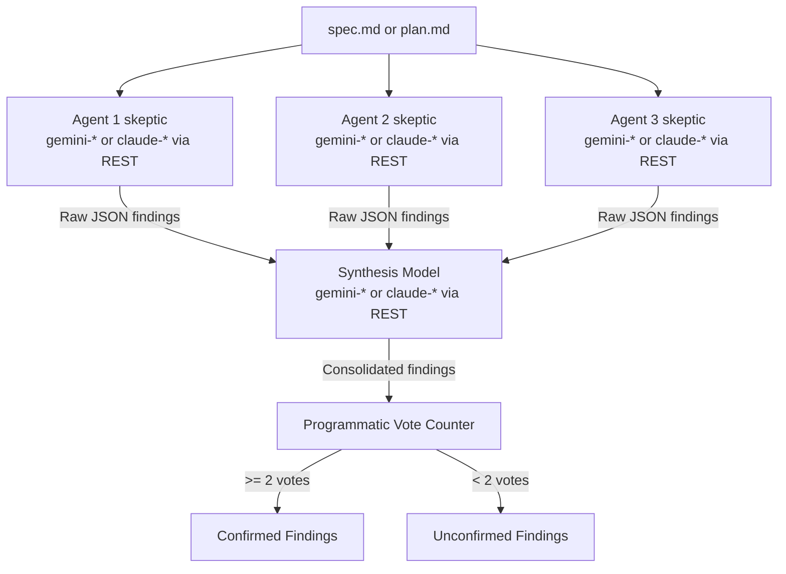

# GEAP Validator Core

Shared engine for the **`geap-spec-validator`** and **`geap-plan-validator`** skills:
adversarial reviews of specs and implementation plans run on **remote Vertex AI
foundation models** — 3 configurable skeptic agents in parallel plus a synthesis model
that consolidates their findings and casts an extra validation vote.

This package replaces the former `cloud-validator` skill (2 skeptics, one skill for
both document types, CWD-relative report). See **Migration from cloud-validator** below.

---

## 🎯 Architecture Overview



1. **Parallel skeptic panel** — the 3 agent slots each hold any `gemini-*` or
   `claude-*` model. **Every call is a direct REST request** to the Vertex AI global
   endpoint (no SDK): the name prefix only selects the verb — `gemini-*` →
   `:generateContent`, `claude-*` → `:rawPredict`. The panel tolerates one failed
   agent (≥ 2 of 3 must succeed) and aborts as "Quorum unreachable" otherwise.
2. **Stage-specific lenses** — a frozen `StageSpec` (`stages.py`) carries everything
   that differs between the two skills: skeptic prompts, finding JSON schema, synthesis
   prompt, report vocabulary, and the plan-only *first domino* nomination.
   - **Spec lenses:** Ambiguity & Malicious-Compliance · Logic & Boundary · Completeness & Testability
   - **Plan lenses:** Dependency & Ordering · Hidden-Assumption · Integration & Failure-Mode
3. **Synthesis model** groups findings by root cause, preserves the agents' stable
   kebab-case IDs, merges the no-hole notes, and validates each consolidated finding.
   Any `gemini-*` or `claude-*` model can be the synthesizer — it goes over the same
   REST transport as the skeptics and is **never silently substituted** on failure
   (3 attempts with temperature tuning, then a hard error).
4. **Programmatic quorum** — votes are counted in Python, never self-reported by
   models: one vote per agent whose output contains the finding (stable-ID match, with
   fuzzy fallback on the stage's match field) + 1 if `validated_by_synthesis`.
   **≥ 2 of 4** possible votes ⇒ Confirmed.

## 🛠️ File Map

| File | Role |
|---|---|
| `stages.py` | `StageSpec` dataclass, `SPEC_STAGE` / `PLAN_STAGE`, all 6 skeptic prompts + 2 synthesis prompts |
| `config_loader.py` | config.json + `GEAP_VALIDATOR_*` env resolution, provider-prefix model validation, `clamp_location()` |
| `client.py` | `CloudInvocationEngine`: prefix routing, retries, JSON schema validation, 3-way parallel fan-out |
| `synthesis.py` | Synthesis call with fallbacks, N-agent quorum (`compute_votes_and_quorum`), `compute_first_domino` |
| `report.py` | Report path resolution (milestone moniker, `-rN` suffixes) + markdown rendering |
| `runner.py` | CLI orchestration — skill wrappers call `main(STAGE, argv)` |
| `config.json` | Shared defaults (both skills read this one file) |
| `tests/` | Unit suite (fully mocked, offline) + E2E integration suite |

The skills themselves are ~18-line wrappers at
`plugins/plan/skills/geap-{spec,plan}-validator/validator.py` that put `<plugin>/lib`
on `sys.path` and pass their `StageSpec` to `runner.main()`.

## 🚀 Setup

This is the **canonical setup sequence** for both skills (the SKILL.md prerequisites
are a condensed version of this). Run once from the repo root:

```bash
# 1. Virtual env (create it once per machine)
uv venv && source .venv/bin/activate   # later sessions: source .venv/bin/activate

# 2. Runtime dependencies — pure REST transport, no Vertex SDK needed
uv pip install httpx google-auth

# 3. Authenticate — ADC, no API keys anywhere (interactive)
gcloud auth application-default login

# 4. Project: config.json's gcp_project_id is used unless overridden per-shell
export GOOGLE_CLOUD_PROJECT=<your-project>   # optional override
```

To run the test suite, additionally: `uv pip install pytest pytest-asyncio`.

## ⚙️ Configuration

Defaults live in [config.json](config.json); each key has an env override:

| config.json Key | Env Variable Override | Description | Default |
|---|---|---|---|
| `gcp_project_id` | `GOOGLE_CLOUD_PROJECT` or `GEAP_VALIDATOR_PROJECT` | Target GCP Project ID | — (required) |
| `gcp_location` | `GEAP_VALIDATOR_LOCATION` | Clamped to `global` — current-gen models are only servable on the global endpoint | `global` |
| `agent_1_model` | `GEAP_VALIDATOR_AGENT_1_MODEL` | Skeptic 1 model | `gemini-3.5-flash` |
| `agent_2_model` | `GEAP_VALIDATOR_AGENT_2_MODEL` | Skeptic 2 model | `claude-haiku-4-5` |
| `agent_3_model` | `GEAP_VALIDATOR_AGENT_3_MODEL` | Skeptic 3 model | `gemini-3.1-flash-lite` |
| `synthesis_model` | `GEAP_VALIDATOR_SYNTHESIS_MODEL` | Synthesis model — any `gemini-*` or `claude-*` | `claude-fable-5` |
| `synthesis_temperature` | `GEAP_VALIDATOR_TEMP` | Sampling temperature | `0.15` |
| `synthesis_max_output_tokens` | `GEAP_VALIDATOR_MAX_TOKENS` | Max output tokens | `8192` |
| `api_timeout_seconds` | `GEAP_VALIDATOR_TIMEOUT` | Per-call timeout | `120` |
| `api_max_retries` | `GEAP_VALIDATOR_RETRIES` | Max retries per call | `3` |

Model names are validated by **provider prefix** (`gemini-*` / `claude-*`), not a
whitelist — any model of a supported provider fits any slot, including synthesis.
Some Claude models (e.g. `claude-fable-5`) reject the `temperature` parameter; the
transport detects the 400 and automatically resends without it.

## 🔌 Endpoint Verification (curl)

All traffic goes to the Vertex AI **global** endpoint — note the host has **no region
prefix**. Verify both provider paths directly:

```bash
TOKEN=$(gcloud auth application-default print-access-token)
PROJ=<your-project>

# Gemini — :generateContent
curl -s -X POST -H "Authorization: Bearer $TOKEN" -H "Content-Type: application/json" \
  "https://aiplatform.googleapis.com/v1/projects/$PROJ/locations/global/publishers/google/models/gemini-3.1-flash-lite:generateContent" \
  -d '{"contents":[{"role":"user","parts":[{"text":"Reply with exactly: OK"}]}],"generationConfig":{"maxOutputTokens":20}}'

# Claude — :rawPredict (omit temperature for claude-fable-5)
curl -s -X POST -H "Authorization: Bearer $TOKEN" -H "Content-Type: application/json" \
  "https://aiplatform.googleapis.com/v1/projects/$PROJ/locations/global/publishers/anthropic/models/claude-fable-5:rawPredict" \
  -d '{"anthropic_version":"vertex-2023-10-16","messages":[{"role":"user","content":"Reply with exactly: OK"}],"max_tokens":20}'
```

Regional hosts (`us-central1-aiplatform...`) return 404/`FAILED_PRECONDITION` for
these models — that is why `gcp_location` is clamped to `global`.

## 💻 Usage

```bash
python3 plugins/plan/skills/geap-spec-validator/validator.py --file plans/active_milestones/<m>/spec.md
python3 plugins/plan/skills/geap-plan-validator/validator.py --file plans/active_milestones/<m>/plan.md
```

Optional flags: `--moniker <m>` (force the milestone), `--config <path>`, `--verbose`.

**Output** — the report is written to
`plans/active_milestones/{moniker}/adversarial-reviews/geap-{spec|plan}-validation.md`
(moniker derived from the `--file` path; fallback `plans/adversarial-reviews/` for bare
artifacts; re-runs auto-suffix `-r2.md`, `-r3.md` — nothing is overwritten). The
absolute report path is printed on stdout.

* **Exit `0`** — passed (no confirmed findings)
* **Exit `1`** — failed (confirmed findings, or an infra error reported on stderr)

## 🔁 Migration from cloud-validator

The `cloud-validator` skill was removed in favor of the two `geap-*` skills. Breaking
changes:

| Was (cloud-validator) | Is now (geap-*) |
|---|---|
| One skill, doc type guessed from filename | `geap-spec-validator` / `geap-plan-validator` — you pick the stage |
| 2 skeptics + synthesis | 3 skeptics + synthesis (new `agent_3_model` key) |
| Model whitelist | Provider-prefix validation (`gemini-*` / `claude-*`) |
| Report at `./cloud-validation-report.md` (CWD) | `plans/active_milestones/{moniker}/adversarial-reviews/geap-*-validation.md` |
| `CLOUD_VALIDATOR_PROJECT` | `GEAP_VALIDATOR_PROJECT` |
| `CLOUD_VALIDATOR_LOCATION` | `GEAP_VALIDATOR_LOCATION` |
| `CLOUD_VALIDATOR_AGENT_1_MODEL` | `GEAP_VALIDATOR_AGENT_1_MODEL` |
| `CLOUD_VALIDATOR_AGENT_2_MODEL` | `GEAP_VALIDATOR_AGENT_2_MODEL` |
| — | `GEAP_VALIDATOR_AGENT_3_MODEL` (new) |
| `CLOUD_VALIDATOR_SYNTHESIS_MODEL` | `GEAP_VALIDATOR_SYNTHESIS_MODEL` |
| `CLOUD_VALIDATOR_TEMP` / `_MAX_TOKENS` / `_TIMEOUT` / `_RETRIES` | `GEAP_VALIDATOR_TEMP` / `_MAX_TOKENS` / `_TIMEOUT` / `_RETRIES` |

`GOOGLE_CLOUD_PROJECT` is honored unchanged. Old `CLOUD_VALIDATOR_*` variables are
silently ignored — re-export them under the new prefix.

## 🧪 Testing

```bash
# Unit (fully mocked, offline — no GCP credentials needed)
pytest plugins/plan/lib/geap_validator_core/tests/unit -v

# E2E integration (real Vertex AI calls, requires ADC)
pytest plugins/plan/lib/geap_validator_core/tests/integration -v
```
